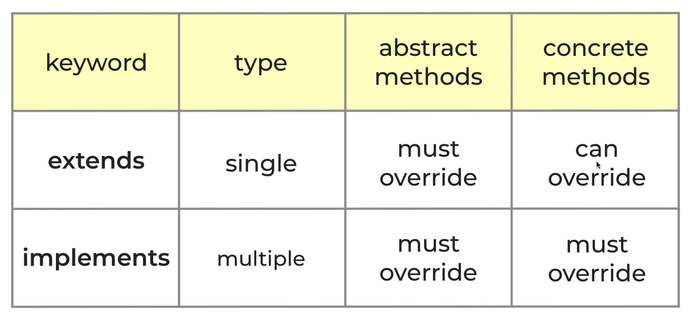

# Advanced Classes

## Stuff I will Learn

1. subclassing(inheritance)
2. super constructor
3. overriding methods
4. abstract classes
5. implements vs extends
6. base object class
7. toString(), == operator, hashCode
8. equatable package
9. generics with classes
10. composition vs inheritance
11. factory constructors
12. copying objects with copyWith
13. cascade operator(..)

## Subclassing

Subclassing extends the functionality of an existing class and increases
code reuse. When I extend an existing class, it is called
subclassing or inheritance. Inheritance allows for a class to inherit
all of the functionality from the parent class.

```dart
class Animal {
  void sleep() => print('sleep');
}
class Dog extends Animal {
  void bark() => print('bark');
}
```

## Super constructor

The super constructor
is the constructor from the parent class. When I extend sub classes from the
parent class, the super constructor is not inherited. In my subclass,
I create a constructor that initializes a new  `int age` variable.
The subclass constructor links the super constructor from
the parent class and I pass in the `age` parameters.

```dart
class Animal {
  const Animal({required this.age});
  final int age;
  void sleep() => print('sleep');
}

class Dog extends Animal {
  Dog({required int age}) : super(age: age);
  void bark() => print('bark');
}
```

It's not possible to instantiate instances of the parent class,
`Animal` without creating a constructor in the subclasses. The
super constructor is not passed to the subclasses. In this case
the `Animal` constructor requires the parameter `age`. If you try
to instantiate the class `Dog` without passing in `age`, the progam
will fail. Also, if you pass in `age` when you instantiate a subclass
without making a constructor, the progam will fail.

## override

The override keyword is used when a subclass makes a copy of the methods in the
parent class, enabling the programer to make changes to it. I
use the override to change the contents of the method and make
it more unique to the subclass. If I want to access the methods from the superclass,
I use the `super.` convention in the subclass.

```dart
class Dog extends Animal {
 @override
  void sleep() {
super.sleep();
print('sleep some more');
  }
  }
```

## abstract classes

Abstract classes are classes that are classes that
cannot be instantiated. They are implemented
 by subclasses. The abstract class is
very powerful because it separates the code interface
and implementation. What this means is that when we can call a
method `printArea()`, we don't have to
specifiy the area calculations for each subclass.
The `printArea()` method only needs a
Shape argument with an area property.
Each subclass is of type Shape,
so when we pass in a `Circle` subclass into `printArea`,
the code works!

```dart
abstract class Shape {
  double get area;
}

class Circle extends Shape {
  Circle(this.radius);
  final double radius;

  @override 
  double get area => pi * radius * radius;
}

void printArea(Shape shape){
  print(shape.area);
}

void main(){
final Shape circle = Circle(6);
  printArea(circle);
}
 
```

## Differences between implements & extends



### multiple class inheritance

An important difference between `implements` and `extends`
is that `implements` can inherit multiple classes, while
`extends` can only inherit one class.

```dart
abstract class InterfaceA {
  void a();
}

abstract class InterfaceB {
  void b();
}

class AB implements InterfaceA, InterfaceB {
  @override 
  void a(){
  }
  @override 
  void b(){
  }
}
```

### override requirement

Another difference is that when you assign a method
inside of an abstract class, you don't have to override
it in the subclass if it uses `extends`. However, if a method is not
assigned in the abstract class, then it is an abstract
method and needs to be overriden.

```dart
abstract class Base {
  void foo();
  void bar() => print('bar');
}

class Subclass extends Base {
  @override 
  void foo() => print('foo');
}
```

Contrastly, when I use the `implements` to inherit an abstract class,
I need to declare both of the functions in the subclass. Even if 
the function was assigned in the parent class, I still need to
declare it in the subclass.

```dart
abstract class Base {
  void foo();
  void bar() => print('bar');
}

class Subclass implements Base {
  @override 
  void foo() => print('foo');

  @override 
  void bar() => print('bar');
}

```

## toString

Sometimes when we want to print the contents of a class,
the code shows an instance of the class. To solve this problem,
you can override the toString method inside of the parent class
to print information that's more useful to the programmer.

This is the problem. The message instance of point is not helpful.

```dart
class Point {
  const Point(this.x, this.y);
  final int x;
  final int y;}

  void main(){
  print(Point(1,1));}
...
...
Instance of 'Point'
```

This is the solution. Overriding the toString() provides helpful
information.

```dart
class Point {
  const Point(this.x, this.y);
  final int x;
  final int y;

  @override
  String toString() => 'Point($x, $y)';
}

void main(){
  print(Point(1,1));}
...
...
Point(1, 1)
```

## equality

When I try to compare two instances of Dart,
the program throws an error
because Dart doesn't know how to. The solution is to use the
equality operator.

problem:

```dart
print(Point(0,0) == Point(0,0));
```

In the example above, the `==` sign returns false. To make it
return true, you can override the `==`. Here's how to do it.

On the left of the `==` put the name `operator` and a boolean type.
The `operator` is a special keyword for the various operators in
Dart.
On the right of the `==` put the arguments of type Point.

The equality operator overrides the equality operation and the argument is of type
Point. It is passed both an x and y value.  

The covariant keyword changes the type of an argument when
overriding a method and throws an error if the argument
is not the correct type at compile time.

```dart
 @override 
  bool operator ==(covariant Point other) {
 
      return x == other.x && y == other.y;
  }
```

## implement '+' and '*' operator

We can implement different types of operator such as
`*` and `+`. The `+` operator returns a Point that adds
the two values together. The `*` operator returns a point that
multiplies the x and y values by the integer.

```dart
 Point operator +(Point other){
    return Point(x+other.x, y+other.y);
  }

  Point operator *(int other){
    return Point(x * other, y * other);
  }

  void main(){
  print(Point(1,1) + Point(2,0));
  print(Point(2,1) * 5);
  }
```

## hashcode

Two objects that are equal should have the same
hashcode and non-equal objects should have
different hashcodes. We should always override
the hashcode when we override `==`. We
use the `equatable` package from pub.dev to help with hashcodes.
The equatable takes care of overriding hashcodes using a list.
It also overrides the `==` operator.

### How to use equatable

1. Install it in pubspec.yaml
2. Import the package
3. Add extends Equatable to our classes
4. Override props variable
5. Override stringify and return true(replaces toString())

```dart
class Point extends Equatable{
  ...
@override
  List<Object> get props => [x,y];

  @override
  bool get stringify => true;
}
```

Equatable should only be used with immutable classes!
Immutable classes are classes that have final variables
and are not altered.

## generics

generics are used to create more reusuable code. They
are very common with functional operators(map, where, reduce).
An example of a generic class is the Stack class. The Stack class
can push or pop items to a list. We can create the Stack to be of
generic type so that when we call it in `main`, the Stack can be
integers or Strings.

```dart
class Stack<T> {
  final List<T> _items = [];

  void push(T item) => _items.add(item);

  T pop() => _items.removeLast();
}

void main(){
  final stack = Stack<int>();
    stack.push(1);
    final names = Stack<String>();
    names.push('Andrea');
}
```

## composition vs inheritance

A Stack has a List which would be composition. Inheritance
is when a Square is a Shape.